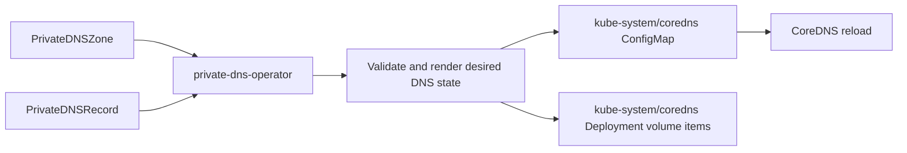

# private-dns-operator

`private-dns-operator` gives platform teams a Kubernetes-native way to manage private DNS zones inside CoreDNS.

Instead of manually editing the CoreDNS ConfigMap, teams define `PrivateDNSZone` and `PrivateDNSRecord` resources. The operator renders the matching CoreDNS configuration, keeps generated records in sync with live Kubernetes state, and cleans up stale records when CRs are deleted.

## Why

Platform teams often need private in-cluster names such as:

```text
api.dev.company.internal
grafana.platform.internal
git.rancher.io
```

Manual CoreDNS edits are fragile, difficult to delegate, and easy to forget during cleanup. This operator turns those edits into declarative Kubernetes resources with status, validation, ownership, and deterministic rendering.

## Features

- `PrivateDNSZone` cluster-scoped API for zone ownership and policy
- `PrivateDNSRecord` namespaced API for delegated record ownership
- supported record types: `A`, `AAAA`, `CNAME`, `TXT`, `MX`, `SRV`
- compatible duplicate records are allowed, such as multiple `A` records for one FQDN
- `CNAME` conflicts are rejected during reconcile
- deterministic full-zone rendering prevents stale record drift
- `Forward` mode supports partial private overrides using CoreDNS `template` + `fallthrough`
- `NXDOMAIN` mode supports strict authoritative private zones using CoreDNS `file`
- CoreDNS ConfigMap patching is restricted to a marked managed block and generated keys
- CoreDNS Deployment volume items are patched only when the ConfigMap mount uses explicit `items`
- CoreDNS `reload` is preferred; rollout restart is used when needed
- CoreDNS target ConfigMap/Deployment can be overridden with flags or environment variables

## Architecture



The operator treats Kubernetes CRs as the source of truth. It rebuilds managed DNS output from live `PrivateDNSZone` and `PrivateDNSRecord` objects on every reconcile instead of mutating individual DNS lines in place.

## API

The API group is:

```text
dns.custlynotts.io/v1alpha1
```

`PrivateDNSZone` is cluster-scoped and owns zone-level policy:

```yaml
apiVersion: dns.custlynotts.io/v1alpha1
kind: PrivateDNSZone
metadata:
  name: rancher
spec:
  zone: rancher.io
  ttl: 300
  unresolvedRecordPolicy: Forward
  allowedNamespaces: {}
  records:
    - name: info
      type: TXT
      values:
        - Rancher private in-cluster DNS zone
```

`PrivateDNSRecord` is namespaced and references a zone:

```yaml
apiVersion: dns.custlynotts.io/v1alpha1
kind: PrivateDNSRecord
metadata:
  name: rancher-git-a
  namespace: default
spec:
  zoneRef:
    name: rancher
  name: git
  type: A
  ttl: 60
  values:
    - 34.208.213.149
```

## DNS Semantics

The operator allows multiple compatible records for the same eventual FQDN. This supports resilient answers such as multiple `A` records for one service name:

```text
git.rancher.io. 60 IN A 34.208.213.149
git.rancher.io. 60 IN A 34.208.213.150
```

The operator rejects DNS-incompatible record sets, especially `CNAME` mixed with any other record at the same FQDN.

## Unresolved Record Policy

`unresolvedRecordPolicy` controls how the operator renders the dedicated CoreDNS server block for a private zone.

- `Forward`: declared records are rendered as CoreDNS `template` stanzas with `fallthrough`, then unresolved names are forwarded upstream.
- `NXDOMAIN`: the zone is rendered with the CoreDNS `file` plugin and behaves as a strict authoritative private zone.

Example `Forward` output:

```text
# BEGIN private-dns-zone-operator

rancher.io:53 {
    errors
    template IN A rancher.io {
        match ^git\.rancher\.io\.$
        answer "{{ .Name }} 60 IN A 34.208.213.149"
        answer "{{ .Name }} 60 IN A 34.208.213.150"
        fallthrough
    }
    forward . /etc/resolv.conf
    cache 30
}
# END private-dns-zone-operator
```

Example `NXDOMAIN` output:

```text
# BEGIN private-dns-zone-operator

rancher.io:53 {
    errors
    file /etc/coredns/rancher-io-a1b2c3.db rancher.io
    cache 30
}
# END private-dns-zone-operator
```

## Status Conditions

`PrivateDNSZone` reports stage-specific conditions so failures are easier to troubleshoot:

- `TemplateRendered`: CoreDNS template records were generated for `Forward` mode
- `ZoneFileRendered`: a zone file was generated for `NXDOMAIN` mode
- `CorefilePatched`: the CoreDNS managed block was patched
- `VolumeMounted`: CoreDNS Deployment volume items are current
- `ReloadTriggered`: CoreDNS reload or rollout restart was triggered
- `LastKnownGoodApplied`: invalid desired state was detected and previous output was kept
- `Ready`: the zone is ready or blocked with a reason

## Safety Model

- The operator only modifies the marked Corefile block between `BEGIN private-dns-zone-operator` and `END private-dns-zone-operator`.
- Generated ConfigMap keys are tracked with `dns.custlynotts.io/managed-zone-keys`.
- Invalid record sets keep the last known good zone file when one exists.
- `PrivateDNSZone` uses a finalizer for zone cleanup.
- `PrivateDNSRecord` deletion is handled by deterministic full-state rendering from remaining CRs.
- CoreDNS `reload` is preferred. If `reload` is absent or volume items changed, the CoreDNS Deployment pod template is annotated to trigger a rollout restart.

## Helm Install

Install the released chart from GHCR:

```bash
helm install private-dns-operator \
  oci://ghcr.io/custlynotts/charts/private-dns-operator \
  --version 1.0.1 \
  --namespace private-dns-system \
  --create-namespace
```

The GitHub release tag, image tag, chart `appVersion`, and chart package version are kept in lockstep. For a git tag `v1.0.1`, the image tag is `v1.0.1` and the Helm chart version is `1.0.1`.

Install from the local chart while developing:

```bash
helm install private-dns-operator ./charts/private-dns-operator \
  --namespace private-dns-system \
  --create-namespace
```

Override the CoreDNS target from values:

```bash
helm install private-dns-operator \
  oci://ghcr.io/custlynotts/charts/private-dns-operator \
  --version 1.0.1 \
  --namespace private-dns-system \
  --create-namespace \
  --set coredns.namespace=kube-system \
  --set coredns.configMap=coredns \
  --set coredns.deployment=coredns
```

Package the chart using the same version as the release tag:

```bash
make helm-package VERSION=v1.0.1
```

Push the chart to GHCR manually if needed:

```bash
make helm-push VERSION=v1.0.1
```

Validate the chart locally:

```bash
make helm-lint
make helm-template
```

## Install

Install CRDs, RBAC, and manager:

```bash
kubectl apply -f config/crd/bases/
kubectl apply -f config/manager/manager.yaml
kubectl apply -f config/rbac/service_account.yaml
kubectl apply -f config/rbac/role.yaml
kubectl apply -f config/rbac/role_binding.yaml
```

Apply samples:

```bash
kubectl apply -f config/samples/
```

Check status:

```bash
kubectl get privatednszones
kubectl get privatednsrecords -A
kubectl -n kube-system get configmap coredns -o yaml
```

## CoreDNS Target Configuration

The default CoreDNS target is:

```text
namespace: kube-system
configmap: coredns
deployment: coredns
```

Override with manager flags:

```bash
--coredns-namespace=kube-system
--coredns-configmap=coredns
--coredns-deployment=coredns
```

Or override with environment variables:

```yaml
env:
  - name: PRIVATE_DNS_COREDNS_NAMESPACE
    value: kube-system
  - name: PRIVATE_DNS_COREDNS_CONFIGMAP
    value: coredns
  - name: PRIVATE_DNS_COREDNS_DEPLOYMENT
    value: coredns
```

When changing the CoreDNS ConfigMap or Deployment name, update the RBAC `resourceNames` in `config/rbac/role.yaml` as well. A Helm chart should template those values from the same CoreDNS settings.

## E2E Smoke Test

After installing the operator into a real cluster:

```bash
./e2e/smoke-test.sh
```

The script verifies private answers, upstream fallback for undeclared names, and stale record cleanup. See [docs/e2e.md](docs/e2e.md).

## Development

```bash
make test
make build
```

Build the release image:

```bash
make docker-build VERSION=v1.0.0
```

Push the release image:

```bash
make docker-push VERSION=v1.0.0
```

## Release

The first release tag is `v1.0.0`.

When a `v*.*.*` tag is pushed, `.github/workflows/release.yaml` builds and publishes the image and Helm chart together:

```text
ghcr.io/custlynotts/private-dns-operator:<tag>
ghcr.io/custlynotts/private-dns-operator:latest
oci://ghcr.io/custlynotts/charts/private-dns-operator --version <tag without v>
```

For `v1.0.1`, the release artifacts are:

```text
ghcr.io/custlynotts/private-dns-operator:v1.0.1
ghcr.io/custlynotts/private-dns-operator:latest
oci://ghcr.io/custlynotts/charts/private-dns-operator --version 1.0.1
```

## Known Limitations

- Admission webhooks are not included yet; validation currently happens during reconcile.
- Helm chart packaging is planned; the static manifests are ready for values-driven templating.
- Autodiscovery of CoreDNS resources is intentionally not enabled. CoreDNS targets are explicit for safety.
