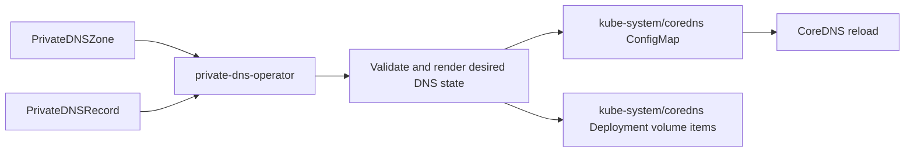

# private-dns-operator

[](https://github.com/CustlyNotts/private-dns-operator/actions/workflows/ci.yaml)
[](https://goreportcard.com/report/github.com/custlynotts/private-dns-operator)
[](https://github.com/CustlyNotts/private-dns-operator/releases/latest)
[](LICENSE)

`private-dns-operator` gives platform teams a Kubernetes-native way to manage private DNS zones inside CoreDNS.

Instead of manually editing the CoreDNS ConfigMap, teams define `PrivateDNSZone` and `PrivateDNSRecord` resources. The operator renders the matching CoreDNS configuration, keeps generated records in sync with live Kubernetes state, and cleans up stale records when CRs are deleted.

## Why

Platform teams often need private in-cluster names such as:

```text
api.dev.company.internal
grafana.platform.internal
git.rancher.io
```

Manual CoreDNS edits are fragile, difficult to delegate, and easy to forget during cleanup. This operator turns those edits into declarative Kubernetes resources with status, validation, ownership, and deterministic rendering.

## Features

- `PrivateDNSZone` cluster-scoped API for zone ownership and policy
- `PrivateDNSRecord` namespaced API for delegated record ownership
- supported record types: `A`, `AAAA`, `CNAME`, `TXT`, `MX`, `SRV`
- compatible duplicate records are allowed, such as multiple `A` records for one FQDN
- `CNAME` conflicts are rejected during reconcile
- deterministic full-zone rendering prevents stale record drift
- `Forward` mode supports partial private overrides using CoreDNS `template` + `fallthrough`
- `NXDOMAIN` mode supports strict authoritative private zones using CoreDNS `file`
- zones are isolated: one invalid zone does not stop the others from reaching CoreDNS
- a zone whose desired state becomes invalid holds its last known good output instead of disappearing from DNS
- CoreDNS ConfigMap patching is restricted to a marked managed block and keys the operator created
- CoreDNS Deployment volume items are patched only when the ConfigMap mount uses explicit `items`
- CoreDNS `reload` is preferred; rollout restart is used when needed
- CoreDNS target ConfigMap/Deployment can be overridden with flags or environment variables

## Architecture


```mermaid
flowchart LR
    Zone[PrivateDNSZone] --> Controller[private-dns-operator]
    Record[PrivateDNSRecord] --> Controller
    Controller --> Render[Validate and render desired DNS state]
    Render --> CM[kube-system/coredns ConfigMap]
    Render --> Deploy[kube-system/coredns Deployment volume items]
    CM --> CoreDNS[CoreDNS reload]
```

The operator treats Kubernetes CRs as the source of truth. It rebuilds managed DNS output from live `PrivateDNSZone` and `PrivateDNSRecord` objects on every reconcile instead of mutating individual DNS lines in place.

## Install

### Helm

```bash
helm upgrade --install private-dns-operator \
  oci://ghcr.io/custlynotts/charts/private-dns-operator \
  --version 1.1.0 \
  --namespace private-dns-operator-system \
  --create-namespace
```

See the [chart README](charts/private-dns-operator/README.md) for the full values reference.

### Plain manifests

Every release publishes a single rendered manifest containing the CRDs, RBAC, namespace, and manager:

```bash
kubectl apply --server-side -f https://github.com/CustlyNotts/private-dns-operator/releases/latest/download/install.yaml
```

### From a checkout

```bash
make install            # kustomize build config/default | kubectl apply --server-side -f -
kubectl apply -f config/samples/
```

Check what happened:

```bash
kubectl get privatednszones
kubectl get privatednsrecords -A
kubectl -n kube-system get configmap coredns -o jsonpath='{.data.Corefile}'
```

### Uninstall

Delete your `PrivateDNSZone` objects **before** removing the operator, in this order:

```bash
kubectl delete privatednszones --all
helm uninstall private-dns-operator --namespace private-dns-operator-system
kubectl delete crd privatednszones.dns.custlynotts.io privatednsrecords.dns.custlynotts.io
```

Each zone carries a finalizer that the operator releases as it cleans the zone out
of CoreDNS. Removing the operator first leaves those zones stuck terminating, the
managed Corefile block in place, and the CRD unable to delete because instances of
it still exist.

If you do get there, release the finalizer by hand:

```bash
kubectl patch privatednszone <name> --type=merge -p '{"metadata":{"finalizers":[]}}'
```

That deletes the Kubernetes object without cleaning CoreDNS, so remove the managed
block between the `# BEGIN private-dns-zone-operator` and
`# END private-dns-zone-operator` markers yourself:

```bash
kubectl -n kube-system edit configmap coredns
```

The operator does **not** need this escape hatch for a misconfigured CoreDNS
target. If the ConfigMap it is pointed at does not exist, or has no `Corefile`
key, there is nothing for it to clean up, so it releases terminating zones and
reports `CoreDNSUnavailable` on the live ones rather than holding them hostage.

## API

The API group is:

```text
dns.custlynotts.io/v1alpha1
```

`PrivateDNSZone` is cluster-scoped and owns zone-level policy:

```yaml
apiVersion: dns.custlynotts.io/v1alpha1
kind: PrivateDNSZone
metadata:
  name: rancher
spec:
  zone: rancher.io
  ttl: 300
  unresolvedRecordPolicy: Forward
  allowedNamespaces: {}
  records:
    - name: info
      type: TXT
      values:
        - Rancher private in-cluster DNS zone
```

`PrivateDNSRecord` is namespaced and references a zone:

```yaml
apiVersion: dns.custlynotts.io/v1alpha1
kind: PrivateDNSRecord
metadata:
  name: rancher-git-a
  namespace: default
spec:
  zoneRef:
    name: rancher
  name: git
  type: A
  ttl: 60
  values:
    - 34.208.213.149
```

Field validation is enforced by the CRD schema, generated from the markers on the Go types in `api/v1alpha1/`. Record type, TTL bounds, and minimum value counts are rejected by the API server before the operator ever sees them.

### Delegation

`spec.allowedNamespaces.matchNames` restricts which namespaces may publish into a zone:

```yaml
spec:
  zone: platform.internal
  allowedNamespaces:
    matchNames:
      - platform
      - observability
```

An **empty list allows every namespace**. Set `matchNames` explicitly on any zone that tenants can reach. See [SECURITY.md](SECURITY.md) for the full threat model.

A record from a namespace the zone does not permit is excluded from the rendered zone and reports `NamespaceNotAllowed` on its own status. It does not affect the zone or any other record, so a namespace that is denied access cannot deny service to the zone. The same applies to a delegated record that is individually malformed.

## DNS Semantics

The operator allows multiple compatible records for the same eventual FQDN. This supports resilient answers such as multiple `A` records for one service name:

```text
git.rancher.io. 60 IN A 34.208.213.149
git.rancher.io. 60 IN A 34.208.213.150
```

Records that share a name and type are merged into one RRset, so it does not matter whether the two addresses above come from one `PrivateDNSRecord` with two values or from two separate objects.

A `CNAME` is the one exception, because DNS requires it to be the only data at its name. The operator rejects a `CNAME` that shares a name with any other record type, and one that resolves to more than one distinct target. Several records naming the *same* target are a compatible duplicate and are accepted, with case and trailing dots normalised before they are compared.

## Unresolved Record Policy

`unresolvedRecordPolicy` controls how the operator renders the dedicated CoreDNS server block for a private zone. It defaults to `NXDOMAIN`.

- `Forward`: declared records are rendered as CoreDNS `template` stanzas with `fallthrough`, then unresolved names are forwarded upstream.
- `NXDOMAIN`: the zone is rendered with the CoreDNS `file` plugin and behaves as a strict authoritative private zone.

Example `Forward` output:

```text
# BEGIN private-dns-zone-operator

rancher.io:53 {
    errors
    template IN A rancher.io {
        match ^git\.rancher\.io\.$
        answer "{{ .Name }} 60 IN A 34.208.213.149"
        answer "{{ .Name }} 60 IN A 34.208.213.150"
        fallthrough
    }
    forward . /etc/resolv.conf
    cache 30
}
# END private-dns-zone-operator
```

Example `NXDOMAIN` output:

```text
# BEGIN private-dns-zone-operator

rancher.io:53 {
    errors
    file /etc/coredns/rancher-io-a1b2c3.db rancher.io
    cache 30
}
# END private-dns-zone-operator
```

## Status

### PrivateDNSZone

`PrivateDNSZone` reports stage-specific conditions so failures are easier to troubleshoot:

| Condition | Meaning |
| --- | --- |
| `TemplateRendered` | CoreDNS template records were generated for `Forward` mode |
| `ZoneFileRendered` | a zone file was generated for `NXDOMAIN` mode |
| `CorefilePatched` | the CoreDNS managed block was patched |
| `VolumeMounted` | CoreDNS Deployment volume items are current |
| `ReloadTriggered` | CoreDNS reload or rollout restart was triggered |
| `LastKnownGoodApplied` | the desired state is invalid, so the previous output is being held |
| `Ready` | the zone is ready, or blocked with a reason |

`Ready=False` reasons are `InvalidZone`, `InvalidRecordSet`, `ZoneRenderFailed`, and
`CoreDNSUnavailable` when the configured CoreDNS ConfigMap cannot be read.

```bash
kubectl get privatednszones
# NAME     ZONE                POLICY    RECORDS   READY   AGE
# rancher  rancher.io          Forward   2         True    4m
```

### PrivateDNSRecord

Each `PrivateDNSRecord` reports its own fate through an `Accepted` condition and the FQDN it resolves, so a tenant can see why their record is not live without reading the zone:

| Reason | Meaning |
| --- | --- |
| `Accepted` | the record is published in its zone |
| `ZoneNotFound` | no `PrivateDNSZone` with that `zoneRef.name` is available |
| `NamespaceNotAllowed` | the zone's `allowedNamespaces` does not list this namespace |
| `InvalidRecord` | the record's name or values were rejected |
| `ZoneNotReady` | the zone itself is blocked, so nothing from it is being published |

```bash
kubectl get privatednsrecords -A
# NAMESPACE  NAME           ZONE     NAME  TYPE  FQDN              ACCEPTED   AGE
# default    rancher-git-a  rancher  git   A     git.rancher.io    True       4m
```

## Safety Model

- The operator only modifies the marked Corefile block between `BEGIN private-dns-zone-operator` and `END private-dns-zone-operator`. Anything outside those markers, including hand-maintained server blocks, is preserved byte for byte.
- Generated ConfigMap keys are tracked in the `dns.custlynotts.io/managed-zone-keys` annotation. That annotation is the only authority on ownership: a zone file the operator did not create is never adopted, deleted, or unmounted, even if it is named like one.
- CoreDNS writes are ordered so its ConfigMap mount is never broken. Because CoreDNS mounts the ConfigMap with explicit volume `items`, a key named in those items has to exist in the ConfigMap or new pods fail to mount, and a file named by the Corefile has to be mounted or CoreDNS exits at startup. Creating a zone needs the ConfigMap written first and retiring one needs the Deployment written first, so the operator expands before it switches and contracts afterwards: add the zone files, mount the union of the old and new keys, switch the Corefile, unmount the retired keys, then delete them. Both conditions hold after every individual write, so a reconcile interrupted at any point leaves CoreDNS servable. A steady-state reconcile writes nothing.
- Zones are isolated. An invalid zone is reported on its own status and skipped; every other zone is still rendered and patched into CoreDNS.
- A zone whose desired state stops being valid keeps its last rendered output, both the Corefile stanza and the zone file, rather than vanishing from DNS. This is reported as `LastKnownGoodApplied`. A zone that has never rendered successfully has nothing to hold and is simply absent.
- `PrivateDNSZone` uses a finalizer for zone cleanup.
- `PrivateDNSRecord` deletion is handled by deterministic full-state rendering from remaining CRs.
- CoreDNS `reload` is preferred. If `reload` is absent or volume items changed, the CoreDNS Deployment pod template is annotated to trigger a rollout restart.
- Status is written only when it actually changes, so a steady-state cluster produces no reconcile churn.

## CoreDNS Target Configuration

The default CoreDNS target is:

```text
namespace: kube-system
configmap: coredns
deployment: coredns
```

Override with manager flags:

```bash
--coredns-namespace=kube-system
--coredns-configmap=coredns
--coredns-deployment=coredns
```

Or with environment variables:

```yaml
env:
  - name: PRIVATE_DNS_COREDNS_NAMESPACE
    value: kube-system
  - name: PRIVATE_DNS_COREDNS_CONFIGMAP
    value: coredns
  - name: PRIVATE_DNS_COREDNS_DEPLOYMENT
    value: coredns
```

The Helm chart templates both the flags and the RBAC `resourceNames` from the same `coredns.*` values, so changing the target there moves the permissions with it:

```bash
helm upgrade --install private-dns-operator \
  oci://ghcr.io/custlynotts/charts/private-dns-operator \
  --namespace private-dns-operator-system --create-namespace \
  --set coredns.namespace=dns-system \
  --set coredns.configMap=coredns-custom \
  --set coredns.deployment=coredns-custom
```

When using the raw manifests in `config/`, update the `resourceNames` in `config/rbac/role.yaml` to match.

## E2E Smoke Test

After installing the operator into a real cluster:

```bash
./e2e/smoke-test.sh
```

The script verifies private answers, upstream fallback for undeclared names, and stale record cleanup. See [docs/e2e.md](docs/e2e.md).

The operator rewrites the CoreDNS ConfigMap in the target namespace, so run this against a disposable cluster, not one you care about.

## Development

```bash
make help              # list every target
make verify            # everything CI runs: fmt, vet, lint, test, codegen, chart, manifests
make test              # unit tests with the race detector
make test-cover        # tests plus a coverage summary
make lint              # golangci-lint
make build             # bin/manager
make run               # run against the current kubeconfig context
```

`api/v1alpha1/zz_generated.deepcopy.go` and `config/crd/bases/*.yaml` are generated. After changing the API types:

```bash
make codegen           # generate + manifests + sync-crds
```

CI fails if a regeneration was skipped. See [CONTRIBUTING.md](CONTRIBUTING.md) for the full workflow, toolchain versions, and commit conventions.

## Release

When a `v*.*.*` tag is pushed, `.github/workflows/release.yaml` verifies the tree, then publishes the image, Helm chart, and install manifest together:

```text
ghcr.io/custlynotts/private-dns-operator:<tag>
ghcr.io/custlynotts/private-dns-operator:latest
oci://ghcr.io/custlynotts/charts/private-dns-operator --version <tag without v>
install.yaml  (GitHub release asset)
```

The GitHub release tag, image tag, chart `appVersion`, and chart package version are kept in lockstep. For a git tag `v1.0.1`, the artifacts are:

```text
ghcr.io/custlynotts/private-dns-operator:v1.0.1
oci://ghcr.io/custlynotts/charts/private-dns-operator --version 1.1.0
```

Images carry SBOMs and build provenance. Verify a published image with:

```bash
gh attestation verify oci://ghcr.io/custlynotts/private-dns-operator:v1.0.1 \
  --repo CustlyNotts/private-dns-operator
```

## Known Limitations

- A zone reaching `Ready` means the operator has written the CoreDNS ConfigMap, not that DNS has changed. The kubelet still has to re-project the ConfigMap volume and CoreDNS still has to reload, which together is routinely 45 to 90 seconds. Automation that asserts on DNS results has to poll rather than sample once.
- The rendered server block uses a fixed `cache 30`, which caps the effective TTL of every answer at 30 seconds regardless of the TTL declared on the zone or record.
- Admission webhooks are not included yet. CRD schema validation covers field shapes; cross-record rules such as `CNAME` conflicts are still evaluated during reconcile and surface on status rather than being rejected at admission.
- Autodiscovery of CoreDNS resources is intentionally not enabled. CoreDNS targets are explicit for safety.
- A single `PrivateDNSZone` per DNS suffix is assumed. Two zones declaring the same suffix will contend for the same rendered stanza.
- The metrics endpoint is unauthenticated, so the chart does not create a Service for it by default.

## Contributing

Issues and pull requests are welcome. Start with [CONTRIBUTING.md](CONTRIBUTING.md), and note the [Code of Conduct](CODE_OF_CONDUCT.md).

For anything security-sensitive, follow [SECURITY.md](SECURITY.md) instead of opening a public issue.

## License

[Apache License 2.0](LICENSE).
